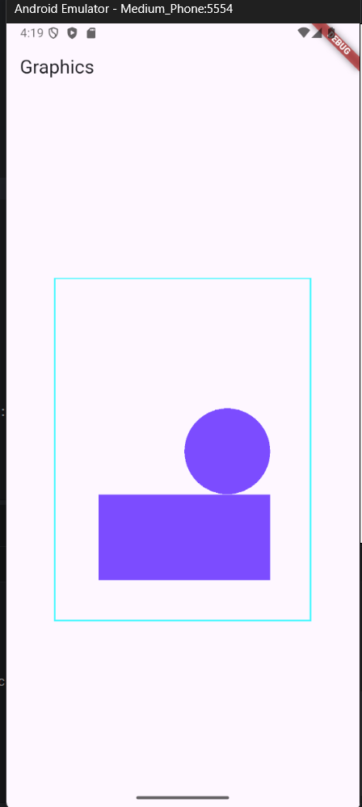

# Experiment 6: Graphics Transformations & Animations in Flutter

## Student Information
* **Name:** Ayush  
* **Roll Number:** 23EACAD025  
* **Batch:** Alpha-1  
* **Section:** G-1  
* **Department:** Artificial Intelligence & Data Science  
* **Course:** B.Tech – AI & Data Science  

---

## Aim
To study and implement **graphics transformations and simple animations** in Flutter using `CustomPaint`, `Transform`, and `AnimationController`.

---

## Procedure
1. Created a new Flutter project.  
2. Defined a `CustomPainter` class to draw basic shapes.  
3. Applied transformations using the `Transform` widget:  
   - Translation (move shapes)  
   - Rotation (rotate shapes)  
   - Scaling (resize shapes)  
4. Implemented `AnimationController` and `Tween` for smooth transitions.  
5. Used `setState()` to update the UI dynamically during animation.  
6. Displayed multiple transformed shapes on the canvas.  

---

## Output
The application successfully demonstrates transformations and animations on graphics primitives.  

- **Output**  
  
<!-- 
- **Rotated Rectangle**  
  

- **Scaled Circle**  
  

- **Animated Translation**  
   -->

---

## Conclusion
This experiment demonstrated how to apply **transformations and animations** to graphics primitives in Flutter, enabling dynamic and interactive visual effects.

---

## How to Run
1. Ensure **Flutter SDK** is installed and added to PATH.  
2. Clone the repository and navigate to the experiment folder:  
   ```bash
   git clone https://github.com/<classroom-org>/<repo-name>.git
   cd <repo-name>/Experiment_6
   flutter pub get
   flutter run
